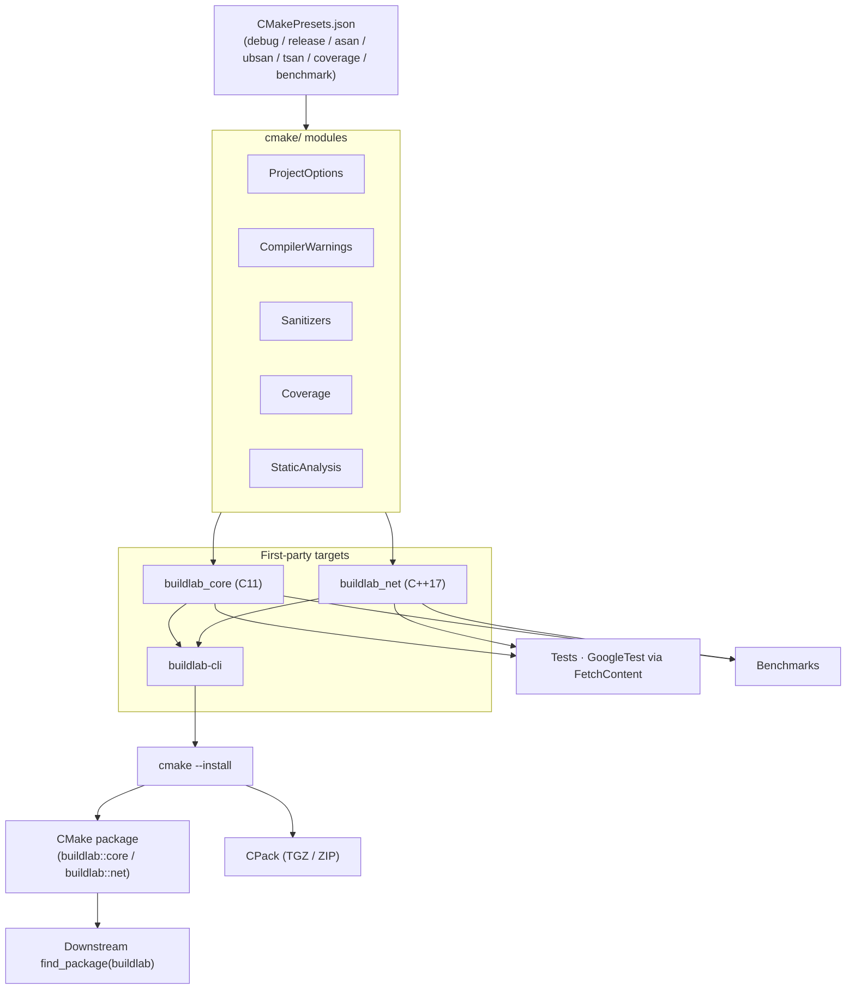

# CMake Systems Build Lab

[](CMakePresets.json)
[](https://en.wikipedia.org/wiki/C11_(C_standard_revision))
[](https://en.cppreference.com/w/cpp/17)
[](https://github.com/czhao-dev/cmake-systems-build-lab/actions/workflows/ci.yml)
[](LICENSE)

A production-style CMake build engineering lab for C/C++ systems projects.

The application code — a small `core`/`net`/`cli` set of libraries and a CLI executable — is intentionally minimal. The build system is the point: presets, target-based design, compiler warnings, sanitizers, coverage, CTest, dependency management, packaging, install/export rules, toolchain files, and CI.

## Features

### Modern CMake

- Target-based design: per-target include directories, compile features, and compile options
- Static and shared library variants
- Custom helper modules under `cmake/` (one concern per file)
- Clean project-options interface via `INTERFACE` targets

### Build Presets

- `debug` — development build with debug symbols
- `release` — optimized build
- `relwithdebinfo` — optimized build with debug symbols
- `asan` — AddressSanitizer
- `ubsan` — UndefinedBehaviorSanitizer
- `tsan` — ThreadSanitizer
- `coverage` — gcov/lcov coverage instrumentation
- `benchmark` — benchmark target

### Testing and Quality

- CTest integration with GoogleTest (fetched via `FetchContent`)
- Unit and integration test targets
- Compiler warning profiles (GCC, Clang, AppleClang)
- Optional `clang-tidy` and `cppcheck` hooks
- Sanitizer and coverage builds

### Packaging and Distribution

- Install rules and exported CMake package targets (`buildlab::core`, `buildlab::net`)
- Package config generation for downstream `find_package(buildlab)`
- CPack packaging (TGZ/ZIP)
- Downstream usage example under `examples/downstream-project/`

### CI

- GitHub Actions matrix: Ubuntu×{GCC debug, GCC release, Clang debug, Clang ASan, Clang UBSan} + macOS×{AppleClang release}
- Separate `static-analysis` job (clang-tidy) and `coverage` job (lcov/gcov upload)

## Architecture



A few design decisions run throughout the codebase:

**One `cmake/` module per concern.** `ProjectOptions`, `CompilerWarnings`, `Sanitizers`, `Coverage`, `StaticAnalysis`, and `PackageConfig` are independent files — each toggled by its own cache variables, each small enough to copy into another project. A monolithic `CMakeLists.txt` would still work, but every concern would be entangled with every other.

**Flags on `INTERFACE` targets, not set globally.** `buildlab_project_options` and `buildlab_project_warnings` are empty `INTERFACE` libraries that carry compiler/linker flags; every first-party target links them `PRIVATE`. This deliberately avoids `add_compile_options()` at the tree root — GoogleTest is fetched via `FetchContent` and built inside this CMake tree, so a global flag would also apply to GoogleTest's own sources, breaking `-Werror` and sanitizer builds on code this project doesn't own.

**`ALIAS` targets before installation.** In-tree consumers (`tests/`, `benchmarks/`, `src/cli/`) link against `buildlab::core` and `buildlab::net` — the same spelling a downstream project uses after `find_package(buildlab)`. There's one mental model for "how do I depend on this library" regardless of whether you're inside the repo or consuming an installed copy.

**Presets instead of remembered `-D` flags.** Every sanitizer/coverage combination is a fixed set of cache variables in `CMakePresets.json`, making configurations reproducible across contributors and CI without memorizing flag sequences.

## Repository Layout

```text
cmake-systems-build-lab/
├── CMakeLists.txt
├── CMakePresets.json
├── Makefile
├── cmake/
│   ├── CompilerWarnings.cmake
│   ├── ProjectOptions.cmake
│   ├── Sanitizers.cmake
│   ├── Coverage.cmake
│   ├── StaticAnalysis.cmake
│   ├── PackageConfig.cmake.in
│   └── toolchains/
│       ├── linux-gcc.cmake
│       ├── linux-clang.cmake
│       └── macos-clang.cmake
├── include/buildlab/
│   ├── core.h
│   └── net.hpp
├── src/
│   ├── core/
│   ├── net/
│   └── cli/
├── tests/
├── benchmarks/
├── examples/downstream-project/
├── packaging/
├── scripts/
│   ├── format.sh
│   ├── run-clang-tidy.sh
│   └── coverage.sh
└── .github/workflows/ci.yml
```

## Quick Start

```bash
git clone https://github.com/czhao-dev/cmake-systems-build-lab.git
cd cmake-systems-build-lab

cmake --preset debug
cmake --build --preset debug
ctest --preset debug

./build/debug/src/cli/buildlab-cli
```

## Build Presets

| Preset           | Purpose                               |
|------------------|---------------------------------------|
| `debug`          | Development build with debug symbols  |
| `release`        | Optimized build                       |
| `relwithdebinfo` | Optimized build with debug symbols    |
| `asan`           | Detect memory errors                  |
| `ubsan`          | Detect undefined behavior             |
| `tsan`           | Detect data races                     |
| `coverage`       | Generate test coverage report         |
| `benchmark`      | Build benchmark targets               |

All presets follow the same three-step pattern:

```bash
cmake --preset <name>
cmake --build --preset <name>
ctest --preset <name>        # where applicable
```

For coverage, run `./scripts/coverage.sh` after `ctest`.

## Optional Makefile Wrapper

A thin `Makefile` wraps common CMake commands:

```bash
make configure-debug    make build-debug    make test-debug
make configure-release  make build-release  make test-release
make asan   make ubsan   make tsan   make coverage   make clean
```

CMake remains the source of truth; the Makefile is convenience only.

## CMake Modules

**`ProjectOptions.cmake`** — top-level cache variables:

```cmake
option(BUILDLAB_BUILD_TESTS       "Build tests"            ON)
option(BUILDLAB_BUILD_BENCHMARKS  "Build benchmarks"       OFF)
option(BUILDLAB_ENABLE_WARNINGS   "Enable compiler warnings" ON)
option(BUILDLAB_ENABLE_SANITIZERS "Enable sanitizers"      OFF)
option(BUILDLAB_ENABLE_COVERAGE   "Enable coverage"        OFF)
option(BUILDLAB_BUILD_SHARED_LIBS "Build shared libraries" OFF)
```

**`CompilerWarnings.cmake`** — warning profiles for GCC, Clang, and AppleClang (`-Wall -Wextra -Wpedantic -Wconversion -Wshadow`, with optional `-Werror`).

**`Sanitizers.cmake`** — AddressSanitizer, UndefinedBehaviorSanitizer, ThreadSanitizer, and optional LeakSanitizer.

**`Coverage.cmake`** — `--coverage`/`-O0`/`-g` flags and an `lcov`/`genhtml` report target.

**`StaticAnalysis.cmake`** — optional hooks for `clang-tidy`, `cppcheck`, and `include-what-you-use`.

## Testing

Tests are written against GoogleTest, fetched automatically via `FetchContent` and built inside the CMake tree but isolated from the project's own warning and sanitizer flags (see Architecture above).

```bash
ctest --preset debug --output-on-failure
```

### Test Results

Results from the most recent local end-to-end verification (Apple Clang 21, macOS arm64, CMake 4.3.2, Ninja):

| Preset           | Configure | Build | Tests        | Notes                                  |
|------------------|-----------|-------|--------------|----------------------------------------|
| `debug`          | ✓         | ✓     | 32/32 passed |                                        |
| `release`        | ✓         | ✓     | 32/32 passed |                                        |
| `relwithdebinfo` | ✓         | ✓     | 32/32 passed |                                        |
| `asan`           | ✓         | ✓     | 32/32 passed | 0 sanitizer reports                    |
| `ubsan`          | ✓         | ✓     | 32/32 passed | 0 sanitizer reports                    |
| `tsan`           | ✓         | ✓     | 32/32 passed | 0 sanitizer reports                    |
| `coverage`       | ✓         | ✓     | 32/32 passed | see coverage table below               |
| `benchmark`      | ✓         | ✓     | n/a          | `buildlab-bench` runs                  |

Also verified: `cmake --install`, CPack (TGZ/ZIP), `examples/downstream-project` `find_package` flow, `scripts/format.sh` idempotency, `scripts/run-clang-tidy.sh`, direct `cppcheck`, and the full Makefile wrapper.

Coverage (Clang source-based, line coverage):

| File                  | Lines covered |
|-----------------------|---------------|
| `src/core/core.c`     | 100%          |
| `src/net/net.cpp`     | 100%          |
| `src/cli/main.cpp`    | 0% (exercised manually) |
| **Total**             | **58%**       |

The two libraries shipped to downstream consumers (`buildlab_core`, `buildlab_net`) are fully covered. The CLI's argument-dispatch code is covered by the manual verification pass.

GitHub Actions CI (see badge): 8/8 jobs passing as of the most recent push.

## Benchmarks

```bash
cmake --preset benchmark
cmake --build --preset benchmark
./build/benchmark/benchmarks/buildlab-bench
```

Benchmark areas: simple parsing helper, string processing, lightweight networking helper, and CLI startup overhead. The code is intentionally small — the focus is the build infrastructure around it.

## Static Analysis

```bash
# clang-tidy
./scripts/run-clang-tidy.sh
# On macOS with Homebrew LLVM:
CLANG_TIDY=/opt/homebrew/opt/llvm/bin/clang-tidy ./scripts/run-clang-tidy.sh build/debug

# cppcheck
cppcheck --enable=all --inconclusive --std=c++17 src include

# clang-format
./scripts/format.sh
```

## Installation and Downstream Usage

```bash
cmake --preset release
cmake --build --preset release
cmake --install build/release --prefix install
```

Installed layout:

```text
install/
├── include/buildlab/
├── lib/
│   ├── libbuildlab_core.a
│   └── libbuildlab_net.a
└── lib/cmake/buildlab/
    ├── buildlabConfig.cmake
    ├── buildlabConfigVersion.cmake
    └── buildlabTargets.cmake
```

A downstream CMake project consumes the package with:

```cmake
find_package(buildlab CONFIG REQUIRED)
target_link_libraries(app PRIVATE buildlab::core buildlab::net)
```

A full standalone downstream example is at `examples/downstream-project/`. Try it after installing:

```bash
cmake --preset release && cmake --build --preset release
cmake --install build/release --prefix "$PWD/install"
cmake -S examples/downstream-project -B examples/downstream-project/build \
      -G Ninja -DCMAKE_PREFIX_PATH="$PWD/install"
cmake --build examples/downstream-project/build
./examples/downstream-project/build/downstream_app
```

## Packaging

```bash
cmake --preset release && cmake --build --preset release
cpack --config build/release/CPackConfig.cmake
```

Supported formats: TGZ, ZIP (DEB and RPM optional).

## Toolchain Files

`cmake/toolchains/` provides example toolchain files for selecting compilers:

```bash
cmake --preset linux-clang-debug
cmake --build --preset linux-clang-debug
```

## Continuous Integration

GitHub Actions (`.github/workflows/ci.yml`) matrix:

| Job             | Platform | Compiler       | Preset  |
|-----------------|----------|----------------|---------|
| build           | Ubuntu   | GCC            | debug   |
| build           | Ubuntu   | GCC            | release |
| build           | Ubuntu   | Clang          | debug   |
| build           | Ubuntu   | Clang          | asan    |
| build           | Ubuntu   | Clang          | ubsan   |
| build           | macOS    | AppleClang     | release |
| static-analysis | Ubuntu   | Clang          | debug   |
| coverage        | Ubuntu   | GCC            | coverage|

ThreadSanitizer is intentionally not in the CI matrix (available locally via `--preset tsan`).

## Suggested Reading Order

```text
1. Root CMakeLists.txt
2. CMakePresets.json
3. cmake/ProjectOptions.cmake
4. cmake/CompilerWarnings.cmake
5. src/core/CMakeLists.txt
6. src/net/CMakeLists.txt
7. tests/CMakeLists.txt
8. Install and export rules
9. .github/workflows/ci.yml
```

## License

This project is licensed under the MIT License. See [LICENSE](LICENSE) for details.
