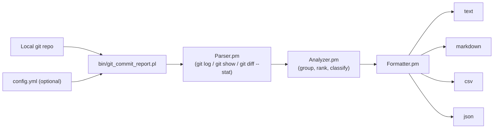

# Git Commit Report Generator

[](https://www.perl.org/)
[](LICENSE)

A Perl CLI that turns local git history into structured engineering activity reports — commits by author, changed files by directory and extension, largest and risky commits, and optional commit-type classification by message keyword.

## Architecture



## Features

- Summarize commits over a selected date range
- Group commits by author, directory, and file extension
- Detect large or risky commits (configurable file-count threshold)
- Classify commits by type — feature, bugfix, refactor, test, docs, build — from message keywords
- Generate daily, weekly, or monthly activity breakdowns
- Output as text, Markdown, CSV, or JSON; write to file or stdout
- Filter by author, branch, date range, and path prefix
- Optional YAML config file for keywords and thresholds

## Project Structure

```text
git-commit-report-generator/
├── bin/
│   └── git_commit_report.pl
├── lib/
│   └── GitCommitReport/
│       ├── Parser.pm
│       ├── Analyzer.pm
│       ├── Formatter.pm
│       └── Utils.pm
├── examples/
│   ├── sample_report.md
│   └── sample_config.yml
├── t/
│   ├── parser.t
│   ├── analyzer.t
│   └── formatter.t
├── Makefile.PL
└── LICENSE
```

## Requirements

- Perl 5.16 or later
- Git
- A local git repository

Recommended modules (some may already be in your Perl installation):

`Getopt::Long`, `File::Find`, `Time::Piece`, `JSON::PP`, `Text::CSV`, `YAML::Tiny`

## Installation

```bash
git clone https://github.com/czhao-dev/git-commit-report-generator.git
cd git-commit-report-generator

# Install dependencies (or use cpanm)
cpan Getopt::Long File::Find Time::Piece JSON::PP Text::CSV YAML::Tiny

chmod +x bin/git_commit_report.pl
```

## Usage

Run inside any git repository:

```bash
# Last 7 days, default text output
perl bin/git_commit_report.pl --since "7 days ago"

# Specific date range, Markdown output to file
perl bin/git_commit_report.pl --since "2026-01-01" --until "2026-01-31" \
    --format markdown --output report.md

# Filter by author and branch
perl bin/git_commit_report.pl --author "Alice" --branch main

# Analyze a subdirectory, top 5 results
perl bin/git_commit_report.pl --path src/ --top 5

# Use a config file
perl bin/git_commit_report.pl --config examples/sample_config.yml
```

## Command-Line Options

| Option                  | Description                                           |
|-------------------------|-------------------------------------------------------|
| `--since <date>`        | Start date for analysis                               |
| `--until <date>`        | End date for analysis                                 |
| `--author <name>`       | Filter commits by author                              |
| `--branch <branch>`     | Analyze a specific branch                             |
| `--path <path>`         | Analyze changes under a specific file or directory    |
| `--format <type>`       | Output format: `text`, `markdown`, `csv`, or `json`   |
| `--output <file>`       | Write report to a file                                |
| `--top <N>`             | Show top N results for ranked sections                |
| `--risky-threshold <N>` | Mark commits touching more than N files as risky      |
| `--config <file>`       | Load keywords and thresholds from a YAML config file  |
| `--help`                | Show help message                                     |

## Sample Output

```text
Git Commit Activity Report
==========================
Repository: example-project
Branch:     main
Date Range: 2026-01-01 to 2026-01-31

Summary
-------
Total commits:   128
Total authors:   6
Files changed:   342
Lines added:     12,450
Lines deleted:   7,820

Commits by Author
-----------------
Alice      42 commits
Bob        31 commits
Charlie    24 commits
Diana      18 commits
Evan       13 commits

Top Changed Directories
-----------------------
src/        156 files changed
tests/       89 files changed
docs/        37 files changed
scripts/     28 files changed

Largest Commits
---------------
1. a1b2c3d  Alice  48 files  Refactor parser module
2. e4f5g6h  Bob    36 files  Add report formatter
3. i7j8k9l  Diana  29 files  Update unit tests

Commit Type Summary
-------------------
Feature        35
Bug Fix        28
Test           22
Refactor       17
Documentation   9
Build           6
Other          11
```

## Commit Classification

Commits are classified by matching keywords in the subject line. The mapping is configurable via YAML.

| Category      | Default Keywords                        |
|---------------|-----------------------------------------|
| Feature       | `add`, `implement`, `support`, `enable` |
| Bug Fix       | `fix`, `bug`, `issue`, `correct`        |
| Refactor      | `refactor`, `cleanup`, `simplify`       |
| Test          | `test`, `coverage`, `unit test`         |
| Documentation | `doc`, `readme`, `comment`              |
| Build         | `build`, `cmake`, `makefile`, `ci`      |

## Configuration File

```yaml
default_format: markdown
risky_commit_file_threshold: 25
top_results: 10

classification:
  feature:   [add, implement, support, enable]
  bugfix:    [fix, bug, issue, correct]
  refactor:  [refactor, cleanup, simplify]
  test:      [test, coverage]
  documentation: [doc, readme]
  build:     [build, cmake, makefile, ci]
```

## Testing

```bash
# Run all unit tests
prove -l t/

# Run a specific test file
prove -l t/parser.t
```

## License

This project is licensed under the MIT License.
