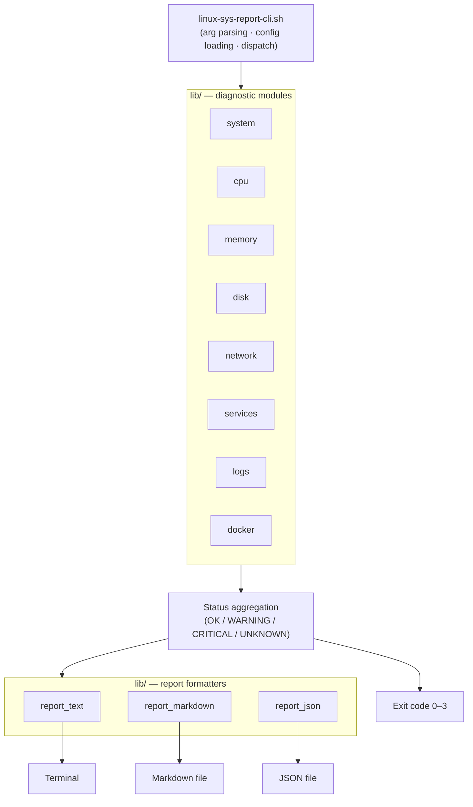

# linux-sys-report-cli

[](https://github.com/czhao-dev/linux-sys-report-cli/actions/workflows/ci.yml)
[](linux-sys-report-cli.sh)
[](LICENSE)

A dependency-free Bash tool for Linux system diagnostics and incident triage.

`linux-sys-report-cli` collects CPU, memory, disk, network, process, service, log, and container data, then generates a readable text, Markdown, or JSON report with an exit code suitable for cron jobs and CI gates.

## Architecture



Every check degrades gracefully: if a required tool (`systemctl`, `docker`, `ss`, …) is absent, that section reports `UNKNOWN` instead of failing the run.

## Features

- **System** — OS, kernel, hostname, and uptime
- **CPU** — load average, core count, load-per-core, top consumers
- **Memory** — usage, swap, top consumers, configurable pressure thresholds
- **Disk** — filesystem and inode usage with warning/critical thresholds
- **Network** — interfaces, default gateway, DNS, internet connectivity, optional HTTP endpoint check, listening ports
- **Services** — failed systemd units, single-service status and logs
- **Logs** — scans `journalctl` or fallback log files for common error patterns
- **Docker** — running/stopped/unhealthy containers, restart counts, resource usage (skipped gracefully if Docker isn't available)
- **Reports** — terminal, Markdown, or JSON output with summary recommendations and a configurable output path

## Quick Start

Clone the repository and run a full report — no build step or dependencies beyond standard Bash and coreutils:

```bash
git clone https://github.com/czhao-dev/linux-sys-report-cli.git
cd linux-sys-report-cli
chmod +x linux-sys-report-cli.sh
./linux-sys-report-cli.sh --full --format markdown
```

For a system-wide `linux-sys-report-cli` command, run `scripts/install.sh` (copies the project to a prefix and symlinks the entrypoint onto `PATH`; default prefix is `/usr/local`, pass `--prefix` for a user-local install).

Sample output is checked in at [`examples/sample-report.md`](examples/sample-report.md) and [`examples/sample-report.json`](examples/sample-report.json).

## Usage

```text
linux-sys-report-cli.sh [options]
```

| Option | Description |
|--------|-------------|
| `--full` | Run all diagnostics |
| `--system`, `--cpu`, `--memory`, `--disk`, `--network`, `--services`, `--logs`, `--docker` | Run an individual category |
| `--service NAME` | Check a specific systemd service |
| `--url URL` | Check an HTTP endpoint |
| `--format text\|markdown\|json` | Output format (default: `text`) |
| `--output PATH` | Write report to a file instead of stdout |
| `--config PATH` | Load thresholds and targets from a config file |
| `--verbose` | More processes, more log lines, more ports |
| `--quiet` | Summary and recommendations only |
| `--help` | Show the help message |

Exit codes: `0` OK · `1` WARNING · `2` CRITICAL · `3` UNKNOWN (worst status across all categories that ran).

## Configuration

`linux-sys-report-cli` optionally reads a `KEY=VALUE` config file via `--config`. Keys are parsed against a fixed allowlist (no arbitrary code execution). Supported keys:

`DISK_WARNING_THRESHOLD`, `DISK_CRITICAL_THRESHOLD`, `INODE_WARNING_THRESHOLD`, `INODE_CRITICAL_THRESHOLD`, `MEMORY_WARNING_THRESHOLD`, `MEMORY_CRITICAL_THRESHOLD`, `PING_TARGET`, `DNS_TEST_HOST`, `HTTP_TEST_URL`, `LOG_LOOKBACK`

See [`tests/fixtures/sample.conf`](tests/fixtures/sample.conf) for an example.

## Project Structure

```text
linux-sys-report-cli/
├── linux-sys-report-cli.sh          # entrypoint
├── lib/
│   ├── common                       # shared helpers (status ranking, JSON escaping)
│   ├── system, cpu, memory, disk
│   ├── network, services, logs, docker
│   └── report_text, report_markdown, report_json
├── tests/
│   ├── common.bats
│   ├── parsing.bats
│   ├── report.bats
│   └── fixtures/
├── examples/
├── scripts/
│   ├── install.sh
│   └── run-shellcheck.sh
└── .github/workflows/ci.yml
```

## Design Principles

**Defensive Bash.** Runs under `set -euo pipefail`, with care taken around the classic `SIGPIPE` pitfalls that strict mode introduces (e.g., truncating a process listing never closes a pipe early on an upstream producer).

**Portable where possible, Linux-first where it matters.** Checks prefer Linux-native sources (`/proc/loadavg`, `/proc/meminfo`, `journalctl`, `systemctl`) and report `UNKNOWN` elsewhere rather than guessing on non-Linux hosts.

**Human-readable by default, structured on request.** Terminal output is for humans; Markdown is for incident notes and PRs; JSON is for automation pipelines.

**Read-only.** `linux-sys-report-cli` never deletes files, restarts services, kills processes, or changes system configuration.

## Testing and Quality

- **ShellCheck** — zero warnings across `linux-sys-report-cli.sh`, every file in `lib/`, and `scripts/` (run via `./scripts/run-shellcheck.sh`).
- **Bats** — 34 tests covering shared helpers (status ranking, JSON escaping, config loading), CLI argument parsing, and all three report formatters (run via `bats tests/`).
- **CI** — every push runs ShellCheck, the full Bats suite, and end-to-end smoke tests of all three output formats on `ubuntu-latest`.

## Limitations

- Does not replace centralized logging or metrics platforms (Prometheus, Grafana, Datadog, etc.).
- Service and log checks require systemd and may need elevated permissions.
- Docker checks require Docker daemon access.
- Some checks report `UNKNOWN` on non-Linux hosts.

## License

This project is licensed under the MIT License. See [LICENSE](LICENSE) for details.
