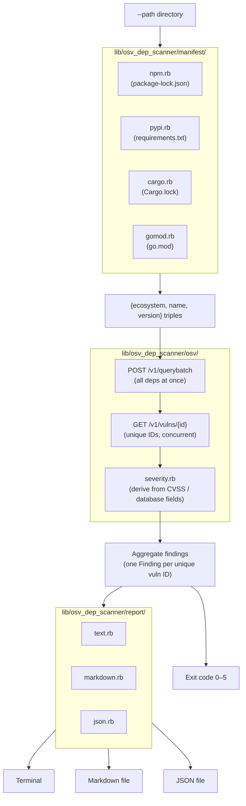

# osv-dep-scanner-cli

[](https://github.com/czhao-dev/systems-dev-tools/actions/workflows/ci.yml)
[](lib/osv_dep_scanner.rb)
[](../LICENSE)

A Ruby CLI that scans a directory for dependency manifests and lockfiles, queries the [OSV.dev](https://osv.dev) vulnerability database, and reports known vulnerabilities as text, Markdown, or JSON — with an exit code suitable for CI gating.

Built entirely on Ruby's standard library (`net/http`, `json`, `optparse`, `find`) — zero runtime gem dependencies.

## Architecture



## Supported Ecosystems

| Ecosystem | File parsed | Notes |
|-----------|-------------|-------|
| npm | `package-lock.json` | Lockfile v2/v3 only (`"packages"` map). v1's nested `dependencies` tree is rejected with a parse error. |
| PyPI | `requirements.txt` | Only `==`-pinned lines. Ranges, unpinned names, extras, and `-r`/`-e`/`--hash` options are skipped. |
| Cargo | `Cargo.lock` | `[[package]]` blocks, parsed with a small hand-rolled line parser — no TOML library needed. |
| Go | `go.mod` | `require` lines, single-line and block form. `replace`/`exclude` directives are ignored. |

**Not supported** (by design, to avoid overclaiming): `Pipfile.lock`, `poetry.lock`, bare `package.json` without a lockfile, `Cargo.toml` version ranges, Perl/CPAN (OSV.dev doesn't track it).

## Quick Start

```bash
cd osv-dep-scanner-cli
bundle install
./bin/osv-dep-scanner --path examples --format markdown
```

`examples/` bundles a fixture set across all four ecosystems, including `lodash@4.17.15` (several real published CVEs), so a fresh checkout has something to find immediately. Sample runs are checked in at [`examples/sample-report.txt`](examples/sample-report.txt), [`examples/sample-report.md`](examples/sample-report.md), and [`examples/sample-report.json`](examples/sample-report.json).

## Usage

```text
osv-dep-scanner [options]
```

| Option | Description |
|--------|-------------|
| `--path PATH` | Directory to scan (default: `.`) |
| `--ecosystems LIST` | Comma-separated subset: `npm,pypi,cargo,gomod` (default: all) |
| `--format text\|markdown\|json` | Output format (default: `text`) |
| `--output PATH` | Write report to a file instead of stdout |
| `--fail-on none\|low\|medium\|high\|critical` | Minimum severity that fails the run (default: `low`) |
| `--timeout SECONDS` | Overall scan timeout (default: `60`) |
| `--osv-base-url URL` | Override the OSV API base URL |
| `--version` / `--help` | |

### Exit Codes

| Code | Meaning |
|------|---------|
| 0 | Clean — no vulnerabilities at or above `--fail-on` |
| 1 | Worst finding is LOW (or severity undetermined) |
| 2 | Worst finding is MEDIUM |
| 3 | Worst finding is HIGH |
| 4 | Worst finding is CRITICAL |
| 5 | Scan error: no manifests found, parse failure, or OSV API error |
| 64 | CLI usage error (bad flags) |

A scan error (code 5) always takes precedence over a severity code — "the scan may be incomplete" is the most important signal to surface, ahead of any specific finding.

## How It Works

1. **Discover** — walk `--path`, skip noise directories (`.git`, `node_modules`, `vendor`, `target`, `dist`, `build`, `.bundle`), and parse every recognized manifest into `{ecosystem, name, version}` triples.
2. **Query** — `POST /v1/querybatch` to OSV.dev with all dependencies at once; returns only vulnerability IDs.
3. **Hydrate** — `GET /v1/vulns/{id}` for each unique vulnerability ID (deduplicated, fetched concurrently) to get summary, severity fields, and references.
4. **Aggregate** — one `Finding` per unique vulnerability ID, even if it affects multiple manifest entries.
5. **Derive severity** — precedence: `database_specific.severity` string → `affected[].ecosystem_specific.severity` string (highest, if several) → CVSS vector present only → treat as `medium` (known simplification) → `unknown`.

The OSV client is duck-typed (`#query_batch` / `#get_vuln`) so orchestration tests inject a fake with no HTTP involved; the client's own tests spin up a local WEBrick server with canned responses.

## Project Structure

```text
osv-dep-scanner-cli/
├── bin/osv-dep-scanner
├── lib/osv_dep_scanner/
│   ├── manifest/          # npm.rb, pypi.rb, cargo.rb, gomod.rb, manifest.rb
│   ├── osv/               # client.rb, severity.rb
│   ├── report/            # text.rb, markdown.rb, json.rb
│   ├── scan.rb
│   ├── aggregate.rb
│   └── cli.rb
├── test/                  # Minitest suite, fixtures under test/fixtures/
└── examples/              # Multi-ecosystem fixture set
```

## Testing and Quality

- **Minitest** — 52 tests across parsers, severity derivation, HTTP client, scan orchestration, report formatters, and CLI option parsing/exit codes.
- **Zero network calls in `rake test`** — orchestration tests use a hand-written fake client; client tests use a local WEBrick server with canned responses.
- **RuboCop** — configured via `.rubocop.yml`.
- **CI** — runs RuboCop, `rake test`, then exercises the real binary against `examples/` in all three formats. The JSON smoke step makes the one live call to OSV.dev in the suite and asserts the known lodash CVE is found (allowed to fail independently on an OSV.dev outage).

```bash
bundle exec rubocop
bundle exec rake test
```

## Limitations

- No real CVSS vector scoring — a vulnerability with only a CVSS vector and no GHSA-style severity string is bucketed as `medium`. This is a known simplification.
- No transitive dependency resolution beyond what's already encoded in the lockfile.
- OSV.dev coverage may lag very recent disclosures.
- No private registry or authenticated-feed support.

## License

This project is licensed under the MIT License. See the [top-level LICENSE](../LICENSE).
