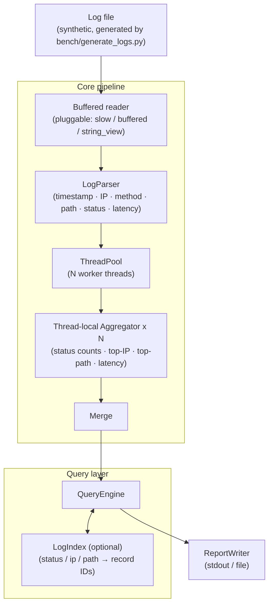

# LogForge

[](https://en.cppreference.com/w/cpp/17)
[](CMakeLists.txt)
[](LICENSE)

A multithreaded C++17 log analytics engine built as a hands-on sandbox for systems debugging, profiling, and performance engineering.

LogForge processes large synthetic log files and supports status-code aggregation, top-IP/top-path queries, latency percentiles, error filtering, and optional query indexing. The goal is not a production analytics platform but a realistic C++ codebase that demonstrates the full engineering loop: build → reproduce a bug or performance issue → apply a tool → identify the root cause → fix → measure the improvement → document the result.

Each tool workflow has a write-up in [`docs/`](docs/) and isolated, intentionally flawed implementations in [`bugs/`](bugs/).

## Architecture



## Example Usage

Log records follow the format:

```text
2026-06-19T10:15:21Z 192.168.1.10 GET /api/users 200 34ms
```

Supported operations:

```bash
./logforge --input logs/server.log --status-counts
./logforge --input logs/server.log --top-ips 10
./logforge --input logs/server.log --top-paths 10
./logforge --input logs/server.log --latency-stats
./logforge --input logs/server.log --errors-only
./logforge --input logs/server.log --threads 8 --status-counts
./logforge --input logs/server.log --build-index
./logforge --input logs/server.log --query "status=500"
```

Example output:

```text
Status Counts         Latency Statistics
-------------         ------------------
200: 824,391          p50:  18 ms
301:  12,044          p95:  92 ms
400:   2,891          p99: 214 ms
404:   5,821          max: 731 ms
500:   1,033
```

## Core Design

### LogParser

Converts raw log lines into `LogRecord` structs. Three implementations are provided for comparison:

- `stringstream` parser — simple but slower
- Manual parser — faster tokenization
- `string_view` parser — reduced temporary allocations

### Aggregation Engine

Thread-local aggregation avoids contention. Workers accumulate local statistics; results are merged once all threads complete:

```cpp
// Flawed design (demonstrates ThreadSanitizer data race):
global_status_counts[record.status]++;

// Correct design:
local_stats[thread_id].status_counts[record.status]++;
// ... then merge after join
```

### Optional Query Index

Maps selected fields to matching record IDs for repeated queries:

```text
status → record IDs
ip     → record IDs
path   → record IDs
```

## Tool Demonstration Matrix

| Category | Tool | Scenario | Skill demonstrated |
|---|---|---|---|
| Interactive debugging | GDB | Parser crash, invalid object state | Source-level C++ debugging |
| Interactive debugging | LLDB | Same workflow on LLVM toolchain | Cross-platform debugging |
| Memory debugging | Valgrind Memcheck | Leak, invalid read, uninitialized value | Deep memory diagnostics |
| Runtime sanitizers | AddressSanitizer | Buffer overflow, use-after-free | Fast memory-error detection |
| Runtime sanitizers | LeakSanitizer | Leaked allocations | Leak detection in sanitizer builds |
| Runtime sanitizers | ThreadSanitizer | Race condition in shared aggregation map | Thread-safety debugging |
| Runtime sanitizers | UndefinedBehaviorSanitizer | Integer overflow, invalid enum, bad shift | Undefined behavior detection |
| System tracing | strace / dtruss | Excessive `read()` syscalls from slow reader | Syscall tracing and I/O analysis |
| CPU profiling | perf | Hot functions, branch/cache behavior | Linux performance profiling |
| Function profiling | gprof | Flat profile and call graph | Function-level profiling |
| Function profiling | gprofng | Function and call-tree analysis | Modern GNU profiling workflow |
| Heap profiling | Valgrind Massif | Peak heap usage in index builder | Memory footprint analysis |
| Heap profiling | heaptrack | Allocation hot spots | Allocation profiling |
| Cache profiling | Cachegrind | Cache misses in parser and aggregation | Cache behavior analysis |
| Call-graph profiling | Callgrind | Expensive call paths | Call-path optimization |
| Static analysis | clang-tidy | Bug-prone patterns, modernization | Static C++ analysis |
| Static analysis | cppcheck | Additional checks | Lightweight code analysis |
| Formatting | clang-format | Consistent style | Automated formatting |
| Coverage | gcov / lcov / llvm-cov | Unit-test coverage | Test quality measurement |

Each tool has a dedicated write-up in `docs/` following the structure: **Problem → Tool → Command → Key output → Root cause → Fix → Result**.

## Repository Structure

```text
LogForge/
├── CMakeLists.txt
├── include/          # LogRecord.h, LogParser.h, LogIndex.h, QueryEngine.h,
│                     # ThreadPool.h, Aggregator.h, ReportWriter.h
├── src/              # LogParser.cpp, LogIndex.cpp, QueryEngine.cpp,
│                     # ThreadPool.cpp, Aggregator.cpp, ReportWriter.cpp, main.cpp
├── tests/            # test_parser.cpp, test_aggregator.cpp,
│                     # test_query_engine.cpp, test_thread_pool.cpp
├── bugs/             # Isolated flawed implementations (one per tool scenario)
│   ├── memory_leak.cpp
│   ├── buffer_overflow.cpp
│   ├── use_after_free.cpp
│   ├── data_race.cpp
│   ├── undefined_behavior.cpp
│   ├── parser_crash.cpp
│   └── syscall_storm.cpp
├── bench/
│   ├── generate_logs.py
│   ├── run_benchmarks.sh
│   └── compare_results.py
├── scripts/          # run_gdb.sh, run_asan.sh, run_tsan.sh, run_perf.sh, ...
├── docs/             # Per-tool write-ups: gdb.md, valgrind.md, asan.md, perf.md, ...
├── docker/           # Dockerfile + docker-compose for Linux-only tools
└── results/          # before/ and after/ benchmark results
```

## Build Instructions

Requirements: Linux (recommended), CMake, C++17 compiler (GCC or Clang), Python 3 for log generation.

Linux-only tools (Valgrind, perf, gprof, gprofng, heaptrack) are available in the Docker environment if you're on macOS — see [`docs/docker_dev_environment.md`](docs/docker_dev_environment.md).

```bash
# Standard release build
cmake -B build -DCMAKE_BUILD_TYPE=Release
cmake --build build
./build/logforge --input logs/server.log --status-counts

# Debug build (for GDB / LLDB)
cmake -B build-debug -DCMAKE_BUILD_TYPE=Debug
cmake --build build-debug

# Sanitizer builds
cmake -B build-asan  -DCMAKE_BUILD_TYPE=Debug -DENABLE_ASAN=ON  && cmake --build build-asan
cmake -B build-tsan  -DCMAKE_BUILD_TYPE=Debug -DENABLE_TSAN=ON  && cmake --build build-tsan
cmake -B build-ubsan -DCMAKE_BUILD_TYPE=Debug -DENABLE_UBSAN=ON && cmake --build build-ubsan

# Coverage build
cmake -B build-coverage -DCMAKE_BUILD_TYPE=Debug -DENABLE_COVERAGE=ON
cmake --build build-coverage && ctest --test-dir build-coverage
lcov --capture --directory build-coverage --output-file coverage.info
genhtml coverage.info --output-directory coverage_html
```

CMake build options:

| Option | Default | Description |
|--------|---------|-------------|
| `ENABLE_ASAN` | OFF | AddressSanitizer |
| `ENABLE_TSAN` | OFF | ThreadSanitizer |
| `ENABLE_UBSAN` | OFF | UndefinedBehaviorSanitizer |
| `ENABLE_GPROF` | OFF | gprof instrumentation (`-pg`) |
| `ENABLE_COVERAGE` | OFF | Coverage instrumentation (`--coverage`) |

## Generating Synthetic Logs

```bash
python3 bench/generate_logs.py --records 10000   --output logs/10k.log
python3 bench/generate_logs.py --records 1000000 --output logs/1m.log
python3 bench/generate_logs.py --records 10000000 --output logs/10m.log
```

All logs are synthetic and contain no private or production data.

## Controlled Bug Demos

`bugs/` contains isolated, intentionally flawed implementations used only for tool demonstrations. They are not part of the main build.

| File | Demonstrates |
|------|-------------|
| `parser_crash.cpp` | GDB and LLDB debugging |
| `memory_leak.cpp` | Valgrind Memcheck and LeakSanitizer |
| `buffer_overflow.cpp` | AddressSanitizer |
| `use_after_free.cpp` | AddressSanitizer and Valgrind |
| `data_race.cpp` | ThreadSanitizer |
| `undefined_behavior.cpp` | UndefinedBehaviorSanitizer |
| `syscall_storm.cpp` | strace/dtruss syscall tracing |

## Benchmarks

```bash
./bench/run_benchmarks.sh
```

| Experiment | Comparison |
|---|---|
| Parser performance | `stringstream` vs manual vs `string_view` parser |
| I/O behavior | One-byte reader vs buffered reader |
| Thread scaling | 1, 2, 4, 8, 16 threads |
| Aggregation strategy | Global lock vs thread-local aggregation |
| Top-K query | Full sort vs min-heap |
| Indexing | Direct scan vs prebuilt index |
| Memory usage | Duplicated strings vs compact record storage |
| Cache behavior | Pointer-heavy storage vs contiguous vectors |

Example results (machine- and compiler-dependent):

| Configuration | Records | Threads | Time |
|---|---|---|---|
| `stringstream` parser | 1,000,000 | 1 | 2.84s |
| `string_view` parser | 1,000,000 | 1 | 1.37s |
| `string_view` + buffered I/O | 1,000,000 | 1 | 1.02s |
| `string_view` + buffered I/O | 1,000,000 | 8 | 0.31s |

## Suggested Workflow

```bash
# 1. Format and static analysis
./scripts/run_format.sh
./scripts/run_clang_tidy.sh && ./scripts/run_cppcheck.sh

# 2. Build and test
cmake -B build-debug -DCMAKE_BUILD_TYPE=Debug
cmake --build build-debug && ctest --test-dir build-debug

# 3. Sanitizer builds
./scripts/run_asan.sh && ./scripts/run_tsan.sh && ./scripts/run_ubsan.sh

# 4. Memory checks
./scripts/run_valgrind.sh

# 5. Profiling experiments
./scripts/run_perf.sh && ./scripts/run_gprof.sh

# 6. Benchmark comparison
./bench/run_benchmarks.sh
```

## Future Improvements

- Memory-mapped file reader
- Compressed log support (gzip, zstd)
- JSON log format parser
- Regex-based filtering
- Persistent on-disk index
- Flamegraph generation (`perf script | FlameGraph/stackcollapse-perf.pl`)
- eBPF-based tracing experiment
- GitHub Actions CI with sanitizer and coverage jobs
- Fuzz testing with libFuzzer or AFL++

## License

This project is licensed under the MIT License. See [LICENSE](LICENSE) for details.
